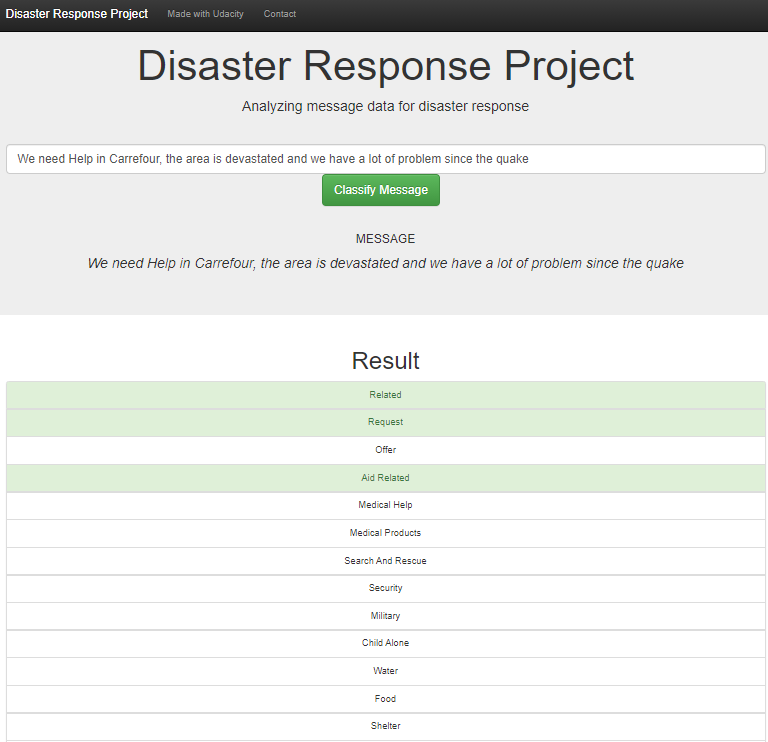

# Disaster Response Pipeline

### Table of Contents

1. [Installation](#installation)
2. [Project Motivation](#motivation)
3. [Program Execution](#files)
4. [Results](#results)
5. [Acknowledgements](#Acknowledgements)

## Installation 
- This project was built using Anaconda version 1.9.12 and Python  3.6.    

- Libraries used:

   - Machine Learning: `sklearn` `pandas` `numpy`
   - Natural Language Process: `nltk`
   - SQLite Database: `sqlchemy`
   - Model Saving and Loading: `sys` `pickle`
   - Web App and Data Visualization: `flash` `plotly`

    
## Project Motivation

This project is to analyze disaster data from Figure Eight to build a model for an API that classifies disaster messages. In the Workspace, you'll find a data sets containing real messages that were sent during disaster events. We created a machine learning pipeline to categorize these events so that the messages can be sent to an appropriate disaster relief agency.

The first part of data pipeline is the Extract, Transform, and Load process. The second part is machine learning(multi-output classification), a pipeline was created using NLTK, as well as scikit-learn's Pipeline and GridSearchCV to output a final model which is saved as pickle file. The third part is a web app where an emergency worker can input a new message and get classification results in 36 categories. The web app also displays visualizations of the data. 

## Program Excution 

- 1. You can run the Jupter notebook file, or excute the files in the project's directory to set up the database, train model and save the model.

    - To run ETL pipeline to clean data and store the processed data in the database
        `python data/process_data.py data/disaster_messages.csv data/disaster_categories.csv data/disaster_response_db.db`
    - To run the ML pipeline that loads data from DB, trains classifier and saves the classifier as a pickle file
        `python models/train_classifier.py data/disaster_response_db.db models/classifier.pkl`

2. Run the following command in the app's directory to start the web app.
    `python run.py

3. Go to http://0.0.0.0:3001/

## Results

The site can be accessed when [demo server](http://maxcn.asuscomm.com:3001) started 

## Licensing, Authors, Acknowledgements
Thanks to [Figure Eight](https://www.figure-eight.com/) for the data and [Udacity](https://www.udacity.com/) provided this topic. 
